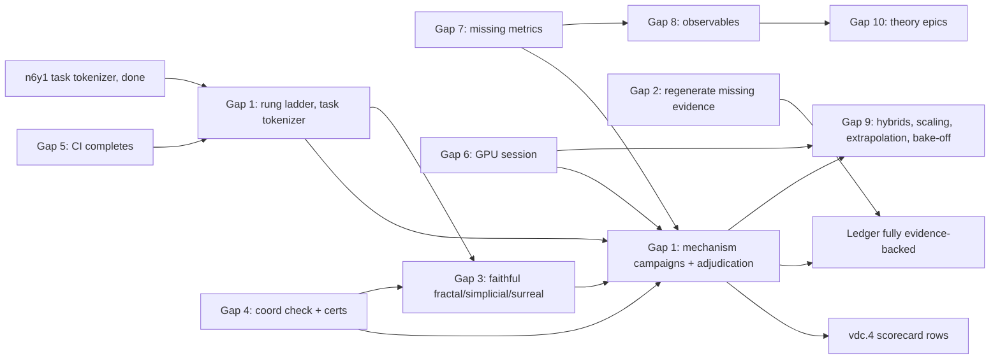

# Bridge Plan: model_guided_research

**Reality check date:** 2026-09-01 (Phase 1, commit fc6afa8); bridge plan written 2026-09-02 against commit e0792c6.
**Gap count:** 6 critical, 5 major, 5 minor.
**Beads:** 272 total (5 open + 5 in progress before this plan). Every gap below says whether the existing beads would close it. Phase 3a was done on 2026-09-03: epic `model_guided_research-jida` (EPIC BRIDGE) parents 31 self-contained beads, one per gap item, with `blocks`/`related` edges to the existing beads that already cover parts of a gap (`br dep tree model_guided_research-jida.1` shows the rung ladder's dependents). The beads carry the background, commands, preregistrations, acceptance criteria and no-claim lines, so this document is now the measuring stick and the progress log, not the work queue.
**Estimated work:** the critical path is compute-bound, not code-bound. On this CPU-only box a single off-floor training run at d128/L4 and 1e14 FLOPs takes about 2 hours; the campaigns below need roughly 40 such runs. One GPU turns that into an afternoon.

This document is the measuring stick for the next ambition and refinement rounds. Revise it in place; do not fork it.

---

## Vision checklist (what the README and AGENTS.md promise)

| # | Goal | Source | Status | Evidence |
|---|------|--------|--------|----------|
| V1 | 13 JAX demos, each faithful to its mathematics, runnable via `mgr run` with property checks | README "13 Mathematical Frameworks" | WORKING | All 13 demos run; gauge demo repaired 2026-09-01 (SPD shape, real value-path comparisons) |
| V2 | 13 selectable nanochat attention types, faithful to the frameworks | README "Nanochat", "13 selectable attention types" | PARTIAL | 10 faithful; fractal, simplicial and surreal are proxies (README now says so; the code has not changed) |
| V3 | Every mechanism passes the new-mechanism checklist (reduction certify, placebo, coordinate check, numerics, interpretability observable, goldens) | docs/new_mechanism_checklist.md | PARTIAL | Reduction certify for 3 of 11; coordinate check for 0 of 11; certificates 81 days stale for 7 mechanisms |
| V4 | Fixed-FLOPs fair comparison harness producing predicted-vs-observed verdicts across the battery x mechanisms | README "Experimental Matrix", bead vdc.4 | UNPROVEN | Harness runs (e2e scorecard scenario) but the production scorecard has zero off-floor rows; copyops floored at every rung 5e10..8e12 |
| V5 | Hypothesis ledger with adjudicated, evidence-backed verdicts | README "Expected Performance Characteristics", docs/research_loop.md | PARTIAL | 52 hypotheses: 7 supported, 3 refuted, 10 inconclusive, 12 blocked, 20 open. Only braid-Dyck and surreal-arith were ever compared to standard off-floor. 8 entries cite artifacts that are not in the repo |
| V6 | The research loop runs end to end on CPU tiny budgets (gen-tasks, train, certify, eval-tasks, sample, adjudicate) | AGENTS.md "Research Loop", scripts/e2e_pipeline.py | WORKING | e2e full-loop and scorecard scenarios; `mgr quickstart` (added 2026-09-01) |
| V7 | CI green on push; nightly e2e green | .github/workflows | UNPROVEN | No CI run has completed since Aug 26: every push since is cancelled by the next push (an auto-committer on this host pushes in bursts). Nightly e2e failed 2026-09-01 12:35 UTC on the pre-fix contract |
| V8 | Three optimizers (adamw, muon, hoss) and the ordinal scheduler are real and distinct | README "Recommended Experimental Protocol" | WORKING | Fixed 2026-09-01 (`pure_adamw` vs `muon` split; per-group ordinal LR); tests in tests/test_checkpoint_resume.py |
| V9 | GPU / FlexAttention path validated | bead 0jk, docs/gpu_flex_diff.md | UNPROVEN | Validated in June; four mechanism edits since (braid decode scaling, trie rewind, reversible autocast, flex mask memo) have never run on a GPU |
| V10 | Machine-checked mathematics: theorem registry + Lean proofs of load-bearing lemmas | epic vnl | PARTIAL | Tranche 1 proved; tranche 2 (mxo3, vnl.3) in progress |
| V11 | Interpretability observable per mechanism in the metrics stream | checklist item 6 | PARTIAL | braid charges, tropical margins, attention entropy exist; gauge curvature, hyperbolic curvature readout, quaternion/octonion rotor stats do not |
| V12 | Documentation states only what the ledger supports | README "Empirical Observations" | WORKING | README rewritten 2026-09-01; stale docs bead g7jd closed |
| V13 | Fixed-FLOPs comparisons measure the mechanism, not the tokenizer | docs/fixed_flops_harness.md | WORKING (unproven in production) | `--tokenizer task` landed 2026-09-02 (bead n6y1). No campaign has used it yet |
| V14 | Hybrid architectures, mixture of mechanisms, scaling-law study, length extrapolation, optimizer bake-off | README "Future Directions (Immediate)" | NOT_STARTED | Beads 7b0.3, 7b0.4, w94, w94.3, vdc.5, rz8.4 exist; all compute-bound |
| V15 | Reach: standalone attention API, docs site | epic swh | NOT_STARTED | p3 beads exist |
| V16 | Reproducibility: bitwise resume, frozen-worktree campaigns, taint propagation | beads rz8.1, nm9j, dz9i | WORKING | Tests and e2e resume scenario |

**Headline:** the tooling is real and now mostly correct; the science is undelivered. The single fact that decides whether this project delivers on its vision is V4/V5: no mechanism has been shown to beat (or lose to) standard attention at a rung where standard actually learns the task, except braid on Dyck (loses) and surreal on arith (null). Everything in the critical section below exists to change that fact.

---

## Critical gaps (block the core value proposition)

### Gap 1: Off-floor mechanism-vs-standard evidence — UNPROVEN to WORKING

**Current state:** `mgr status` reports 42 of 52 hypotheses cannot be ruled on today: 13 have no candidate artifacts, 15 have no operationalized prediction, 9 lack the metric, 4 are on manual hold, 1 is tainted. The vdc.4 scorecard (`artifacts/scorecards`) has no row where the standard baseline cleared the answer-prior floor. The copyops diagnostic (bead r7qn, 2026-09-01) found the cause: at d64 the 50,304-token GPT-2 vocabulary is 96.6% of every FLOP, so a fixed-FLOPs budget bought almost no transformer body. `nanochat/train.py --tokenizer task` (bead n6y1) removes that cost: a 512-token byte-level BPE gives the body about 25x more tokens per FLOP at the same budget.

**Target state:** for each battery task there is a recorded rung (model size, budget) where all three standard seeds clear the floor, and at that rung every registered mechanism-vs-standard hypothesis for that task has a SUPPORTED, REFUTED or INCONCLUSIVE verdict backed by committed artifacts.

**Success criteria:**
- [ ] `artifacts/probes/sizing/` holds a task-tokenizer rung ladder for copyops, hier, needle, dyck, arith and group, each with the standard arm at 3 seeds and the recorded answer-prior floor.
- [ ] `mgr status --json` shows `engine_today.no_candidate_artifacts` at 0 for the mechanism-vs-standard hypotheses (`hyp-reversible-copyops-inversion`, `hyp-ultrametric-hier-heldout-depth`, `hyp-fractal-hier-heldout-depth`, `hyp-ultrametric-needle-long-context`, `hyp-tropical-needle-no-dilution`, `hyp-braid-length-generalization`, `hyp-placebo-no-winner`).
- [ ] The vdc.4 scorecard report has at least one floor-passing row per task, and the predicted-vs-observed table is non-empty.
- [ ] Every cited artifact is committed (force-added) so `evidence_missing` stays empty.

**Implementation plan:**
1. Preregister on bead r7qn the exact successor coordinate (this is the campaign_preregistration_template): task tokenizer at 512, standard arm, d64/L2 at budgets 1e12, 2e12, 4e12, then d128/L4 at 1e13, 3e13, 1e14; 3 seeds; metric `exact_match.greedy.held_out`; stopping rule "first rung where all three seeds exceed the floor by 0.10".
2. Run the ladder from a detached clean worktree (`git worktree add --detach`, campaign runs are refused on a dirty tree) with `mgr scorecard --tokenizer task` or `nanochat.train --tokenizer task`; keep outputs under `artifacts/probes/sizing/` (quarantined, never in the default evidence pool).
3. At the found rung, run each registered mechanism arm plus the placebo arm at the power-derived seed count (docs/campaign_preregistration_template.md); adjudicate with `mgr adjudicate` (ci-v6); append verdicts.
4. Run `mgr scorecard` for the full battery at that rung (vdc.4) and commit the report.
5. If a task has no rung reachable on CPU within 1e14 FLOPs, record that as the probe's verdict and move the task to the GPU list (Gap 6).

**Dependencies:** Gap 5 (CI must complete so regressions are caught before compute is spent); Gap 4 for the coordinate check (checklist item 3 wants the width-scaling coordinate confirmed before cross-mechanism comparisons at d128).
**Would existing beads close it?** Partially. vdc.4 (in progress) and r7qn (open) cover the scorecard and the diagnostic; n6y1 delivered the tokenizer. New beads are needed for the preregistered rung ladder per task, the per-task campaigns, and the artifact commits.
**Estimated complexity:** XL (compute), S (code).
**Vision goals served:** V4, V5, V13.

### Gap 2: Ledger verdicts citing artifacts that are not in the repo — PARTIAL to WORKING

**Current state:** `mgr status --json` lists 8 entries whose cited artifacts are absent: `hyp-symplectic-nonorm-depth-tied`, `hyp-symplectic-nonorm-depth-untied` (six e2-symp-tied / e2-std-norm campaign runs), `hyp-rmatrix-s5-length-slope`, `hyp-rmatrix-solvable-control-specificity`, `hyp-rmatrix-charge-decodability`, `hyp-padic-truncation-graceful`, `hyp-padic-truncation-graceful-k16`, `hyp-padic-truncation-depth-independent`. Two of those are SUPPORTED. Bead uej2 is in progress; three other entries were regenerated and re-adjudicated on 2026-09-02 (run review-regen-2026-09-02).

**Target state:** every verdict in `hypotheses/registry.yaml` cites artifacts present in the tree, or is superseded by a re-adjudication from regenerated evidence.

**Success criteria:**
- [ ] `mgr status --json | jq '.evidence_missing | length'` prints 0.
- [ ] `tests/test_adjudicate.py::test_status_flags_verdicts_whose_cited_artifacts_are_absent` stays green.
- [ ] Each regenerated verdict cites a run id that names the regeneration date.

**Implementation plan:**
1. p-adic truncation trio: rerun the ultrametric truncation sweep (`mgr certify`/bench paths named in the registry `evidence.artifacts` fields) from a clean worktree; commit under `artifacts/bench/` with force-add.
2. rmatrix trio: rerun the e2e word-problem scenario at the registered sizes (`scripts/e2e_pipeline.py --scenario word-problem` produces the slope tables) and the charge-decodability probe; commit.
3. Symplectic pair: six training runs (reversible tied/untied vs standard-with-norm) at the registered budget; on CPU these are the most expensive items in this gap. Re-adjudicate; the note on bead n68c says these cannot be decided on val_CE because the no-norm arm runs at activation norm about 260, so register the replacement metric first.
4. Append the new verdicts (registry is append-only) and close uej2.

**Dependencies:** none for the code; compute for the symplectic pair.
**Would existing beads close it?** Yes: uej2 plus n68c.
**Estimated complexity:** M (L for the symplectic pair on CPU).
**Vision goals served:** V5, V12.

### Gap 3: Three proxy mechanisms sold as faithful — PARTIAL to WORKING

**Current state:** `nanochat/fractal_attention_torch.py`, `simplicial_attention_torch.py` and `surreal_torch.py` implement simplified stand-ins (a router-simplex over fixed memories, a pairwise-only "two-hop" approximation, a scaled-attention variant with transseries labels) rather than the constructions in markdown_documentation/. README now labels them proxies; the registry hypotheses for them (`hyp-fractal-hier-heldout-depth`, `hyp-simplicial-two-hop-composition`, `hyp-surreal-*`) therefore test the proxy, not the theory.

**Target state:** either each proxy is replaced by a faithful mechanism that passes the new-mechanism checklist, or the hypothesis registry scopes each claim to "proxy tier" with a named successor hypothesis for the faithful version.

**Success criteria:**
- [ ] Fractal: an IFS memory whose contraction maps are learned and whose capacity is measured by the Moran dimension (bead 8gk.5 unifies this with the ultrametric trie); `mgr certify fractal` includes a contraction and an address-decoding check.
- [ ] Simplicial: genuine 2-simplex (triplet) attention over a sparse neighbourhood with the mass-conservation certify check extended to the triangle term; a placebo that keeps the parameter count but randomizes the triangles.
- [ ] Surreal: the scaling-axis construction from the transseries design doc, with `hyp-surreal-scaling-axis-prediction` operationalized (it is blocked today).
- [ ] Goldens recaptured in the same commit as each GPTConfig change; docs/new_mechanism_checklist.md audit table updated.

**Implementation plan:**
1. Write the exact reduction each faithful mechanism has to a known one (checklist item 1) as a certify check before writing the mechanism.
2. Implement in place in the existing module (no new files), behind the same `attention_type` names, so configs and the registry do not change.
3. Register the faithful-tier hypotheses before evidence exists; run at the Gap 1 rung.

**Dependencies:** Gap 1 (a rung to test at); Gap 4 (the checklist gate).
**Would existing beads close it?** Partially: 8gk.5 covers fractal. Simplicial and surreal have no bead.
**Estimated complexity:** L each.
**Vision goals served:** V2, V3, V5.

### Gap 4: New-mechanism checklist gate incomplete — PARTIAL to WORKING

**Current state:** the audit table in docs/new_mechanism_checklist.md shows coordinate check (lab.1) at "no" for all eleven mechanisms, reduction-to-known certify for three (tropical, ultrametric, octonion), and `mgr status` shows certificates 81 days old for tropical, ultrametric, quaternion, octonion, simplicial, fractal (braid recaptured 2026-09-02). Beads lab.1 and bp08 (`--parameterization nsa`, coord-check artifact schema) are in progress.

**Target state:** every mechanism has a fresh certificate at HEAD, a coordinate-check artifact, and, where a sub-mechanism exists, a reduction check.

**Success criteria:**
- [ ] `mgr status --json | jq '[.certificates[] | select(.stale==true)] | length'` prints 0 after a `mgr certify --all` recapture committed with force-add.
- [ ] A coord-check artifact per mechanism under `artifacts/coordcheck/` and `hyp-coordcheck-clt-flat` adjudicated.
- [ ] Reduction certs for gauge (to standard with QK-norm), braid (zero-charge limit to standard), reversible (identity coupling to a plain block).

**Implementation plan:**
1. Finish bp08: `--parameterization nsa` end to end, coord-check artifact schema, engine ingestion.
2. Add the three reduction checks to `mgr certify` in nanochat/model_utils.py / the mechanism modules.
3. Recapture certificates for all mechanisms from a clean worktree and commit them in one commit.

**Dependencies:** none.
**Would existing beads close it?** Partially: lab.1 and bp08 cover the coordinate check; certificate refresh and the reduction certs need beads.
**Estimated complexity:** M.
**Vision goals served:** V3.

### Gap 5: CI has not completed since Aug 26 — UNPROVEN to WORKING

**Current state:** the workflows were fixed on 2026-09-01 (ruff 0.16 formatting, no `-x`, slow marker split, lean job order, nightly full-suite job, scorecard contract v3) but GitHub shows every CI run since then as cancelled by the next push, and the last completed run is a failure at fc6afa8. Pushes arrive in bursts from an auto-committer on this host (four commits and pushes within one minute on 2026-09-02 02:38 UTC, authored as the owner with a Claude co-author trailer). The nightly e2e failure on 2026-09-01 12:35 UTC predates the contract fix.

**Target state:** a completed green CI run at HEAD and a completed green nightly run.

**Success criteria:**
- [ ] `gh run list --workflow CI --limit 1 --json conclusion` prints success at HEAD.
- [ ] `gh run list --workflow "E2E Pipeline (nightly)" --limit 1` prints success.

**Implementation plan:**
1. Wait for the run at 24b4920 or later to complete without a competing push; read the log; fix whatever fails.
2. Owner decision: either the auto-committer batches its pushes, or `.github/workflows/ci.yml` sets `concurrency.cancel-in-progress: false` so bursts queue instead of cancelling.
3. Trigger the nightly manually once (`gh workflow run e2e-nightly.yml`) after CI is green.

**Dependencies:** none.
**Would existing beads close it?** No bead covers it; 7af7 records the host hazard.
**Estimated complexity:** S.
**Vision goals served:** V7.

### Gap 6: No GPU evidence for four mechanism changes — UNPROVEN to WORKING

**Current state:** this host has no GPU. The braid decode scaling fix, the ultrametric trie rewind, the reversible autocast recompute and the FlexAttention block-mask memo were validated on CPU only. Goldens are pinned to this host and torch 2.13.

**Target state:** the golden, certify and e2e determinism suites pass on a CUDA box under bf16 autocast, and GPU goldens are captured.

**Success criteria:**
- [ ] `MGR_CAPTURE_ATTENTION_GOLDENS=1 uv run pytest tests/test_attention_core_goldens.py` on a GPU host, committed as a second golden set keyed by device.
- [ ] `mgr certify --all --device cuda` green.
- [ ] `scripts/e2e_pipeline.py --scenario determinism` green on cuda.

**Implementation plan:** one session on a GPU box running the three commands above and committing the results; if anything fails, file bugs with the device-specific trace.

**Dependencies:** GPU access.
**Would existing beads close it?** No.
**Estimated complexity:** S given hardware.
**Vision goals served:** V9, and it unblocks the 3e14+ budgets in Gap 1.

---

## Major gaps (significantly degrade the vision)

### Gap 7: 24 hypotheses cannot be ruled on because their metric or prediction does not exist

**Current state:** engine readiness lists 15 hypotheses with `prediction_not_operationalized` and 9 with `metric_missing`. Examples: `hyp-gauge-gradient-stability`, `hyp-reversible-gradient-stability`, `hyp-octonion-norm-stability` (need per-step gradient and activation norm statistics in metrics.jsonl), `hyp-tropical-robustness-perturbation` and `hyp-tropical-certified-robustness` (need an eval mode with input perturbation and the margin certificate), `hyp-hensel-curriculum-parity` (needs the curriculum flag), `hyp-tie-locus-density-decreases` (needs the tie-locus probe), `hyp-hyperbolic-curvature-readout`, `hyp-surreal-scaling-axis-prediction`, `hyp-group-nonsolvable-barrier`.

**Target state:** each of the 24 either has its metric emitted by the trainer or evaluator and a numeric prediction registered, or is retired with a reason.

**Success criteria:**
- [ ] `engine_today.prediction_not_operationalized + metric_missing` at most 4 (the ones that genuinely need scale).
- [ ] Each new metric has a unit test proving it lands in metrics.jsonl or the eval summary.

**Implementation plan:** group by metric: (a) gradient and activation norm statistics per block, one trainer change serves four hypotheses; (b) perturbation eval mode in `mgr eval-tasks` serves the two tropical robustness claims and 8gk.7; (c) tie-locus density probe (tropical and ultrametric) as a certify observable; (d) hyperbolic curvature readout as a metrics-stream observable (also Gap 8).
**Would existing beads close it?** Partially: 8gk.7 covers certified robustness; the rest need beads.
**Estimated complexity:** M.
**Vision goals served:** V5, V11.

### Gap 8: Interpretability observables missing for half the mechanisms

**Current state:** braid conserved charges, tropical margins and attention entropy are in the metrics stream. Gauge curvature (bead u55.2), hyperbolic curvature, quaternion/octonion rotor norms, ultrametric LCP depth histogram, reversible shadow energy are not first-class.
**Target state:** one named observable per mechanism in `summary.json` and metrics.jsonl, each with a registered leading-indicator hypothesis (bead 5ki.5 pattern).
**Success criteria:** `tests/test_eval_tasks.py` or the certify suite asserts presence per mechanism; `mgr viz` renders it.
**Would existing beads close it?** Partially: u55.2 and 5ki.5.
**Estimated complexity:** M. **Vision goals served:** V11.

### Gap 9: Compute-bound studies not started (hybrids, mixture of mechanisms, scaling laws, length extrapolation, optimizer bake-off)

**Current state:** beads 7b0.3, 7b0.4, w94, w94.3, vdc.5, rz8.4 exist with detailed comments. Nothing has run because the rung problem (Gap 1) made every comparison floored.
**Target state:** each study has a preregistered coordinate and at least one adjudicated verdict.
**Would existing beads close it?** Yes, once Gap 1 and Gap 6 unblock them.
**Estimated complexity:** XL (compute). **Vision goals served:** V14.

### Gap 10: Theory epics partially delivered (Theory I/II/III, formal proofs, capstone)

**Current state:** epics 8gk, u55, lab, vnl and the capstone cbm are open with child beads in progress (lab.1, bp08, mxo3). These are the long-horizon differentiators; they are correctly sequenced behind the empirical rungs.
**Would existing beads close it?** Yes.
**Estimated complexity:** XL. **Vision goals served:** V10.

### Gap 11: `mgr` surface still carries dormant paths

**Current state:** bead 43dd lists nanochat modules with no caller (decision needed: wire in or delete; deletion needs owner permission). rz8.6 (env-var registry), 63ko (per-arm flags), pni6 (campaign val cadence) are small and open.
**Would existing beads close it?** Yes.
**Estimated complexity:** S each. **Vision goals served:** V6, V12.

---

## Minor gaps (polish)

- **Gap 12: host hazard (bead 7af7).** Something on this host hard-resets working trees to origin and, separately, auto-commits and pushes. Not code; needs the owner to identify the process. Until then: commit after every batch and work on main so the auto-committer's commits are not orphaned.
- **Gap 13: reach (epic swh).** Standalone API wheel and docs site; p3.
- **Gap 14: kernels (7b0.7).** Tropical max-plus Triton kernel; needs GPU.
- **Gap 15: route observatory (8gk.9), region-count experiments (oeno).** Research extras behind Gap 1.
- **Gap 16: docs.** docs/fixed_flops_harness.md and docs/config_parity_suite.md should describe `--tokenizer task` and its effect on the FLOPs coordinate (small edit, do with the first campaign that uses it).

---

## Prioritized order

1. Gap 5 (CI completes) — hours, unblocks trust in everything else.
2. Gap 1 step 1 and 2 (preregister and run the task-tokenizer rung ladder) — the single most valuable compute on the project.
3. Gap 2 (regenerate missing evidence) — runs in parallel with 2 on spare cores.
4. Gap 4 (bp08 coordinate check, certificate refresh) — code, parallel with the compute.
5. Gap 7 metric group (a) and (b) — code, parallel.
6. Gap 1 steps 3 and 4 (campaigns and vdc.4) — after the rung is known.
7. Gap 6 (GPU session) — as soon as hardware exists; it also lifts the budget ceiling for 6.
8. Gap 3 (faithful fractal, simplicial, surreal) — after the rung exists to test them at.
9. Gaps 8, 9, 10, 11, then the minor gaps.

## Dependency graph

## Progress log

Dated entries only; each names the gap it moves and the evidence.

- **2026-09-02 (Gap 4).** Certificates refreshed for all 13 mechanisms at commit 0eeb168 from a clean worktree (64/64 checks pass, `artifacts/certs/nanochat/cert-refresh-2026-09-02`). `mgr status` staleness is now decided by git history (source changed after the certificate's commit) instead of file mtimes, which had flagged every certificate stale after any checkout; all 13 read fresh.
- **2026-09-02 (Gap 5).** Root cause of "no CI run completes" found in two parts: pushes arrive in bursts and each push also produces a run on `master` (the mirror branch), and one run whose jobs were cancelled kept its aggregate job queued forever, holding the concurrency group. That zombie run was cancelled. A manually dispatched run then also sat `pending` with zero jobs for 20 minutes on a public repo with Actions enabled and GitHub reporting Actions operational, so job scheduling itself is not happening for this repository: an account-level condition the owner has to look at on the Actions page.
- **2026-09-02 (Gap 1).** Successor coordinate preregistered on bead r7qn (task tokenizer, d64/L2, budgets 1e12/2e12/4e12 then 8e12, seeds 0-2, metric `exact_match.greedy.held_out`, rule "all three seeds >= floor + 0.10"). The 1e12 rung is running from worktree `vdc4-copyops-tasktok-f76c159`; the 2e12 and 4e12 suites were started and stopped (the host was loaded to 50 by other sessions' jobs) and resume with the same command minus `--fresh`. Measured alone, the coordinate trains at 6.6k tokens/s, so a rung is minutes of compute, not hours; contention is the only obstacle.
- **2026-09-02 (Gap 1, result and two defects).** The 1e12 task-tokenizer rung did NOT clear: held-out and in-range exact match 0.0 for all three seeds while training loss fell to 0.3-0.5. Measured on the seed-0 checkpoint: loss 0.92 on the training stream in corpus order, 4.48 on the same documents shuffled, 5.48 on validation. The loader replayed the 800-document train split in the same order about 93 times, so the model learned which document follows which, not the task. Two fixes landed (commit 5dce958): the loader now visits each row group's documents in a per-epoch permutation seeded by `--seed` (`--data-shuffle epoch`, the default; the epoch is part of the resume state), and the evaluator prepends the trainer's `<|bos|>` to prompts and perplexity documents (`mgr.evaltasks.v4`; v3 and v4 artifacts must never share an arm). Every earlier campaign on a 1000-document corpus at 1e14 ran about 30 epochs in fixed order too; their held-out verdicts are not inflated by this (unseen documents), but their baselines were weaker than the FLOPs suggest (new bead from r7qn). Preregistration #2 on r7qn scales the corpus so each rung is at most two epochs (40k documents at 1e12).
- **2026-09-02 (Gap 1, second rung).** With the shuffled loader, the BOS-consistent evaluator and a 40k-document corpus, the 1e12 copyops rung is clean but still does not clear: exact match 0.0 on all seeds, training loss 2.1, in-range perplexity 9.4 (now consistent with the loss). The model has not learned the copy mapping at 1.3M tokens with d64/L2. Per the stopping rule the 2e12 rung (100k documents) and, if needed, 4e12 (200k) are queued, and the same 1e12 rung is queued for the nine other battery tasks (preregistered on vdc.4). Each cell takes about a minute when the host is free; the host is shared and was at load 60 for most of the day.
- **2026-09-02 (Gap 7, three hypotheses).** The trainer now records per-block gradient norms and per-block activation RMS on every logged step and summarizes them under `results.depth_telemetry` (spike ratio, depth ratios, per-block means and finals). That is the "per-step grad-norm / per-layer activation telemetry" that `hyp-gauge-gradient-stability`, `hyp-reversible-gradient-stability` and `hyp-octonion-norm-stability` name as their operationalization blocker; registering their predictions against these paths is the owner's call.
- **2026-09-02 (Gap 1, arith).** The arith rung clears at 1e12 on training seed 0: held-out exact match 0.81 against a floor of 0.51, in-range 1.0. Seeds 1 and 2 pending. This is also the apparatus's positive control: after two "nothing" reports on copyops, the same pipeline can report an off-floor rung. The comparison campaign at a cleared coordinate will retrain the baseline with training seeds 3 to 5, because seeds 0 to 2 selected the coordinate and are spent.
- **2026-09-02 (theorem registry, epistemic audit).** Applying the frontier-math discipline (a label never creates evidence) to `hypotheses/theorems.yaml`: all Lean sources are sorry-free and every audited lemma depends only on propext, Classical.choice and Quot.sound (axiom audit re-run locally). Statement-match audit of the five `lean-checked` entries found two labels broader than their artifacts: the Gromov-product theorem is formalized for rooted binary trees only and its boundary-ultrametric clause is on paper; the kick-kick symplectic theorem is formalized as the linear-algebra core (symmetric-block shear Jacobians are symplectic and compose), not as the "exact integrator" statement. Both are downgraded to `proved-on-paper` with a `formalization` block recording exactly what is checked; ordinal termination gains a partial block (abstract core checked, CNF-rank clause pending bead mxo3). The shadow-Hamiltonian statement silently assumed tied potentials; that hypothesis is now written into it. `mgr theorems validate` now requires every `lean-checked` label to carry a formalization block whose lemmas are printed by `proofs/AxiomCheck.lean`, so the CI sorry gate actually binds the label; neither registry validator ran in CI before today, both do now.
- **2026-09-02 (theorem registry, falsification checks).** Three of the twelve proved-on-paper theorems without a numerical check now have one that can fail: BCH nilpotent termination gets a new test that shows the weight-2 truncation is exact on the step-2 (Heisenberg) algebra, is NOT exact on the step-3 algebra (kill witness, error 6.7e-4), and that the weight-3 polynomial is (error 1.7e-16); the shadow-Hamiltonian theorem is linked to the existing 64-layer tied energy-band certificate; the curvature-homotopy theorem is linked to the existing minimum-curvature reduction certificate (its R-tree endpoint stays unchecked). The gauge demo's BCH fusion helper is documented by that test as second-order only. Bead ofig tracks the remaining nine.
- **2026-09-02 (apparatus calibration).** Two controls the verdict engine never had are now registered and running. Negative control: the placebo-guard campaign (`hyp-placebo-no-winner`, 33 cells: standard plus ten mechanisms on the placebo task at 1e12) in the production pool; the scorecard cannot publish until it is supported. Positive control: a new `control_zero_attention` config flag turns any Block-based model into a per-token MLP stack that cannot mix context (same graph, same training, recorded in model_config for the engine's variant selectors); `hyp-control-no-context-planted-effect` claims standard beats that arm by 0.20 held-out exact match on arith at equal FLOPs, with fresh training seeds 3 to 5 for both arms. If the engine does not return SUPPORTED on a planted effect of that size, every two-arm verdict at the coordinate is uninterpretable. The arith rung itself cleared on all three seeds (0.81/0.86/0.85 vs floor 0.51). All background campaigns were stopped from outside the session once and restarted two at a time; the task ladder is on hier.
- **2026-09-02 (Gap 1, the full ladder at 1e12).** Every battery task now has a rung result at d64/L2 with the corrected pipeline. Cleared: arith (0.81/0.86/0.85 vs floor 0.51) and dyck (0.85/0.86/0.86 vs 0.56). Group clears in-range (0.55 to 0.69 vs 0.10) while its held-out length split stays floored, which is exactly the precondition the rmatrix length-slope hypotheses require. Floored: hier, needle, rot, rel, bag (bag below the constant answer), copyops. Regime cannot produce the exact-match metric its two hypotheses register (no answer marker): a wiring defect, bead w76r. Next rungs at 2e12 with 100k documents are queued for the floored tasks; the dyck comparison (braid vs fresh standard, five seeds) and the group comparison (braid rmatrix vs standard) are preregistered and running. Lesson recorded: the harness kills session-background jobs at turn end; all compute now runs detached from idempotent scripts.
- **2026-09-02 (scorecard per-arm variants, bead 63ko).** `mgr scorecard --mechanism MECHANISM@key=value` now trains a mechanism with one recorded knob changed as its own arm, validated against GPTConfig fields and trainer flags, with its own cells and directories, recorded in the manifest, and accepted by the hypothesis-coverage check whenever a registry `baseline.variant` or `candidate_variant` selector names it (a selector equal to the config default resolves to the plain arm). The control arm, the rmatrix arm and the symplectic tied/untied arms no longer need hand scripts. The same syntax now works in `mgr bench-fixed-flops -a MECH@key=value`; bead 63ko is closed.
- **2026-09-02 (positive control adjudicated: SUPPORTED).** The planted-effect control came back exactly as predicted. Standard at fresh seeds 3 to 5 scores 0.81/0.88/0.88 held-out on arith; the no-context arm scores 0.5069 on every seed, the answer prior to four decimals. The engine ruled SUPPORTED under ci-v6 with effect 0.347, CI [0.258, 0.437], three seeds per arm, 100% power, q = 0.0097. So the evaluator, the equal-FLOPs cohorts, the variant selectors and the statistics can see an effect of this size on the two-arm path. The negative control (placebo guard) is still pending compute. Every two-arm verdict at this coordinate is now interpretable in both directions once that lands.
- **2026-09-02 (scorecard robustness on a shared host).** The first dyck-comparison and placebo-guard cells died at exactly 7200 seconds: the scorecard's per-cell timeout was below the 3.5 hours a cell takes when two other sessions hold most of the cores. Fixed at the source: the default timeout is now ten hours, a retried cell resumes from its last committed checkpoint in exact-replay mode instead of retraining (`resumed_from_step` in the manifest), the arm bookkeeping moved out of the compared config so old suites still resume, and every detached job runs narrower (four threads) to stop thrashing. All three suites were relaunched; no evidence was taken from the timed-out cells.
- **2026-09-02 (Gap 11, bead 43dd).** `nanochat/loss_eval.py` is no longer orphaned: validation now reports bits per byte next to cross-entropy (`val_bpb_final`), the metric that stays comparable when the tokenizer changes. The remaining orphans are listed on the bead for the owner's per-file decision.
- **2026-09-02 (bead pni6).** `scripts/run_campaign.py` validates by default, so every campaign records `val_ce_final`.
- **2026-09-02 (bead w76r, regime task v2).** The regime task was a pure stream with no answer marker, so the held-out exact-match metric that `hyp-ordinal-regime-recovery` and `hyp-hoss-regime-curvature` registered on 2026-08-24 was null on every evaluation: two hypotheses that could never be adjudicated as written, and nothing in the validator objected. Generator v2 appends an `OUT` block of four values continuing the final regime (the checker rejects a wrong continuation, a first-regime continuation, an empty answer and a broken stream), the difficulty axis is the shift count (held-out doubles it), and the dial defaults shrink to 12 values x 3 regimes so a held-out document (~190 tokens) is about three training windows at sequence_len 64 rather than seven, and stays inside the rotary cache down to sequence_len 32 (the evaluator skips prompts that do not fit). `mgr hypotheses validate` now rejects any answer-scoring metric on a task without an answer marker. Coordinate consequence: the v1 regime probe at 1e12 is quarantined and the regime rung must be found again on v2 before either hypothesis gets a comparison.
- **2026-09-02 (bead bp08, coordinate check wired end to end).** The coordinate-check harness, its artifact writer and the engine's ingestion of `mgr.bench.coord_curves.v1` all existed, but nothing produced the artifact and the two hypotheses it serves still had `prediction: null`. `mgr coord-check` now writes one artifact per (mechanism, parameterization arm, seed) from init-time forwards over the width ladder 64..2048 (no training), `hyp-coordcheck-clt-flat` and `hyp-tropical-evt-miscoupling` are operationalized (flatness as `abs_loglog_slope <= 0.05` for standard and reversible; the EVT claim as the nsa-minus-current separation of at least 0.05, so a pair flat under both arms refutes it), and a test drives the real registry entries through the engine with planted slopes to show both SUPPORTED and REFUTED are reachable. The evidence run and adjudication follow from a clean tree.
- **2026-09-02 (coordinate-check verdicts).** From a clean tree, widths 64..2048: standard and reversible are flat (|slope| at or below 0.0015 on three seeds each), so `hyp-coordcheck-clt-flat` is SUPPORTED. Tropical with the tropical FFN drifts under the current rule (|slope| about 0.10) and drifts slightly more under the nsa correction (about 0.12); the power tool asked for six seeds per arm before any verdict, the tropical arms were expanded to seeds 3-5, and `hyp-tropical-evt-miscoupling` is REFUTED at 98% power (separation +0.019 with CI [-0.009, 0.047] against the registered -0.05). The exact-E[max] location shift is not where the width drift enters; the successor is a diagnostic bead, not a re-registration.
- **2026-09-03 (Gap 7, scaling fits are ledger evidence).** The scaling sweep and its fits already existed (`mgr scaling-sweep`, `mgr scaling-report`); what the ledger lacked was an artifact the engine could attribute to an arm. The report now also writes one `mgr.bench.scaling_fit.v1` summary per mechanism (exponent, bootstrap interval, amplitude, floor, fit quality, provenance naming the fitted runs), indexed as bench evidence, so exponent claims against standard can be registered and adjudicated. The surreal scaling-axis entry stays blocked for a real reason: its claim needs a three-axis ladder with oracle ground truth, an experiment the lab.2 epic has to design.
- **2026-09-03 (Gap 8 corrected and the ultrametric observables).** A survey of the metrics stream showed the plan over-counted the missing observables: hyperbolic curvature (per-head curvature, radius, hierarchy and Euclidean head fractions) and the reversible symplectic shadow energy are already per-step series, and quaternion rotors are unit by construction, so a rotor-norm series would be a tautology. The genuine gap was ultrametric: the kernel path now records the mean LCP depth of each query's chosen route and the tie fraction (two deepest routes within a digit) when `--ultrametric-record-routes` is on, the trainer summarizes the tie fraction's first-to-last change, and `hyp-tie-locus-density-decreases-ultrametric` is registered on it pre-evidence. Ledger: 49 of 65 entries operationalized.
- **2026-09-03 (Gap 7, the perturbation ladder).** `mgr eval-tasks --perturb-eps` now scores exact match again under each eps of a ladder with the repository's single perturbation spec applied to every scoring forward (one pinned draw stream per document), and records per rung the perturbed exact match, the per-document degradation, and for margin-recording tropical checkpoints the certified fraction and the certificate's violation rate (schema `mgr.evaltasks.v5`). The two tropical robustness hypotheses are operationalized pre-evidence on the eps 0.1 rung of held-out arith (degradation ratio at most 0.5 with a validity floor on standard's degradation; certificate violation rate at most 0.05), and bead 8gk.7's certified-robustness benchmark has its measurement. Ledger: 48 of 64 entries operationalized; the class-level coordinate-check flatness claims and the faithful-tier successors account for the growth.
- **2026-09-03 (Gap 4, reduction certificates settled).** Gauge now has its reduction-to-known check: with the connection network zeroed, the gauge attention path equals plain causal attention on its own projections (the standard sub-block without QK-norm), certified at fp32 with a vacuity guard and a kill-witness test. Braid and reversible were analyzed rather than forced: braid's sigmoid additive accumulation has no softmax limit and reversible's RevNet coupling has no plain-block limit, so their known-answer checks remain the algebraic laws already certified; the audit table records both analyses. Proxy-tier notes and faithful-tier successors for fractal, simplicial and surreal are in the registry (Gap 3 bookkeeping) with config-knob selectors the faithful builds must record.
- **2026-09-03 (Gap 4, the coordinate-check column is filled).** `mgr coord-check` measured the nine mechanisms it had not covered (gauge, braid, ultrametric, hyperbolic, quaternion, octonion, simplicial, fractal, surreal) on seeds 0 to 2 and then on fresh seeds 3 to 5: every one is flat in width at init (|slope| below 0.003), so tropical stays the only drifting mechanism. Three class-level flatness hypotheses (isometry; branching and radial; CLT-assumed) were registered with the spent-seed disclosure and adjudicated SUPPORTED. The checklist audit table now has a reading in every coordinate-check row; the remaining "no" cells are the three reduction certificates (bead jida.17). The window rule and the per-task token table are in the harness docs and the preregistration template (jida.31).
- **2026-09-03 (the hard-reset sweeper is identified).** A reflog trap caught it at 00:18:54 UTC: an SSH session from 173.56.62.32 runs an inline script that walks every `.git` directory under /data/projects, checks out the default branch and hard-resets it to origin with no dirty-tree check, then calls `ru sync --restart`; it fires twice a few minutes apart on a roughly six-hour cadence, which is the paired-reset signature seen since 2026-09-01. Linked worktrees are untouched because their `.git` is a file. The fix belongs to the remote script (skip dirty trees); bead 7af7 carries the evidence. Until then the working rule stands: commit and push after every batch.
- **2026-09-03 (the negative control reported "nothing").** The placebo guard trained every mechanism on the structure-free placebo task at 1e12 (33 cells) and `hyp-placebo-no-winner` was adjudicated: nine of ten mechanisms sit within 1.2% of standard's placebo perplexity with tight intervals, which is the apparatus reporting nothing where nothing is learnable. Fractal, a proxy mechanism, is 2.15% worse with an interval straddling the registered 1.02 bound, so the for-all verdict is INCONCLUSIVE and the scorecard publication gate stays blocked. The power tool showed no seed expansion was warranted, and none was taken; a fractal-only replication on fresh seeds can resolve the straddle only if it is registered first.
- **2026-09-02 (six more hypotheses made adjudicable).** Three entries blocked since June on "needs depth telemetry" now have predictions on the telemetry that landed today: reversible gradient stability (block gradient-norm balance across depth 8, at least 0.20 better than standard), gauge gradient stability (gradient spike ratio at most half of standard's at depth 8, with a validity floor that makes the "standard spikes" premise checkable) and octonion/quaternion norm stability (activation balance across depth 8; the no-norms reading is not testable because the config refuses norm removal for non-standard attention, disclosed). Training summaries now record the diagnostics task name (`dataset.task`) and the engine's selectors read it, which unblocks the hyperbolic curvature readout as two successors (hier heads above the curvature threshold; placebo heads in the Euclidean band). The tie-locus trend is registered as a tropical successor on the route-coverage delta. All six are pre-evidence (the engine reports no candidate artifacts); the depth-8 rung and an annealing campaign will feed them. Ledger: 46 of 56 entries operationalized.
- **2026-09-02 (the window was the floor).** Measuring document lengths against the CPU coordinate's 64-token training window explains most of the ladder's floors: hier, needle and rel documents do not fit the window even in range (about 175, 163 and 76 GPT-2 tokens), and the held-out documents of bag, group and regime exceed it. Regime made the case directly: floored at 1e12 and sequence length 64, cleared at 2e12 and sequence length 256 with held-out exact match 0.08/0.24/0.17 against a 0.042 prior. The regime comparison (ordinal and hoss arms against standard, seeds 3 to 5) runs at that coordinate, and a preregistered sequence-length-256 ladder for hier, needle, bag, rel and group is running; rot, copyops, dyck and arith fit at 64 and keep their ladders. The group comparison at sequence length 64 ended with both rmatrix slope hypotheses INCONCLUSIVE at a floored held-out split. Correction the same evening: group's held-out split stays floored at sequence length 256 (0.007 to 0.035 against 0.097) although its documents now fit, so for group the floor is task difficulty at this budget, not the window; hier, needle, bag and rel are likewise floored at 2e12 with the window fixed, and the ladder's 4e12 step runs for all five.
- **2026-09-02 (scorecard training arms).** The scorecard rejected `--mechanism ordinal` and `--mechanism hoss` because they are not attention types, so the three ordinal/hoss hypotheses had no path through the battery runner although the trainer flags, the recorded summary fields and the verdict engine's arm matching all existed. The scorecard now trains those arms as standard attention with `--scheduler-type ordinal` or `--optimizer-type hoss`, refuses hoss as the campaign-global optimizer (the baseline must stay non-hoss for the arms to be distinguishable), and the regime comparison can run as one suite with its standard baseline and placebo cells.

## Verification plan

After the bridge work, each vision goal is checked by a command, not a claim:

- [ ] V4/V5: `mgr status --json` shows `evidence_missing` empty and at least 7 mechanism-vs-standard hypotheses with verdicts at floor-passing rungs; `mgr scorecard` report for vdc.4 has a non-empty predicted-vs-observed table.
- [ ] V2/V3: docs/new_mechanism_checklist.md audit table has no "no" in the coordinate-check column and no proxy rows; `mgr certify --all` fresh at HEAD. (2026-09-02: certificates fresh for all 13 mechanisms; `mgr coord-check` covers standard, reversible and tropical, the other eight are still unchecked; fractal, simplicial and surreal remain proxies.)
- [x] V6: `scripts/e2e_pipeline.py --scenario all` exits 0 on CPU (2026-09-02 at HEAD: full-loop, resume, determinism, regression-gate, scorecard, word-problem, symplectic all PASS).
- [ ] V7: latest CI and nightly runs completed with success.
- [ ] V9: GPU goldens committed; `mgr certify --all --device cuda` green.
- [ ] V11: every mechanism's observable asserted by a test.
- [ ] V13: at least one committed campaign trained with `--tokenizer task`, its checkpoints carrying `tokenizer/tokenizer.json`.
- [ ] V14: one adjudicated verdict per compute-bound study.
- [x] V16: `scripts/e2e_pipeline.py --scenario resume --scenario determinism` green (2026-09-02 on CPU at e7f5845; run separately because the flag kept only its last value until the same-day fix).
